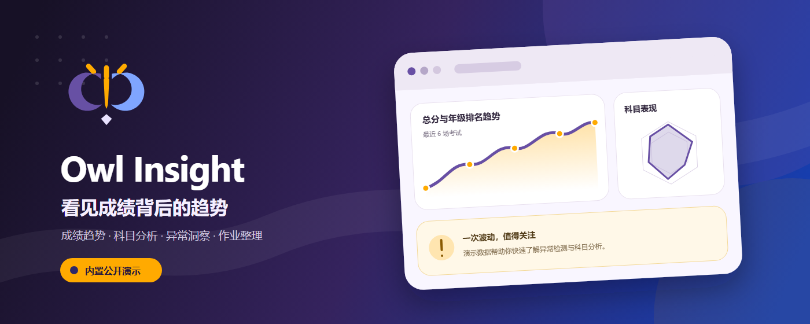
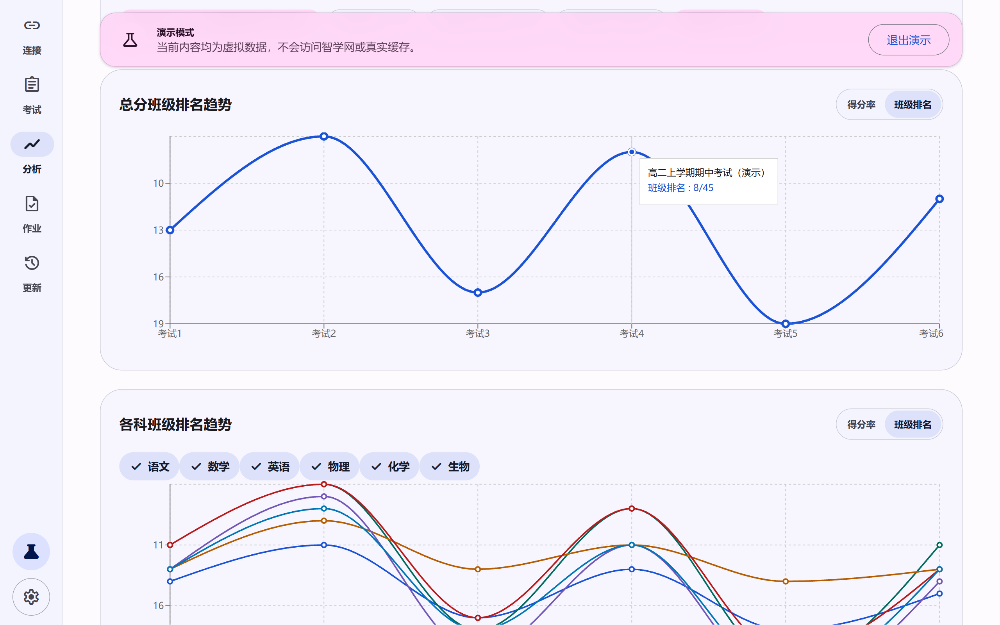
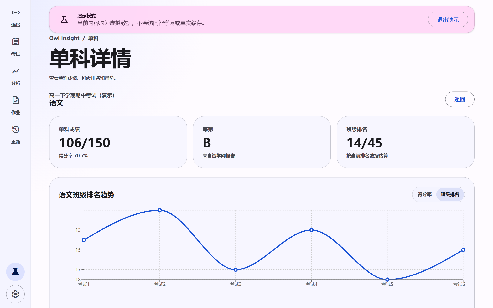
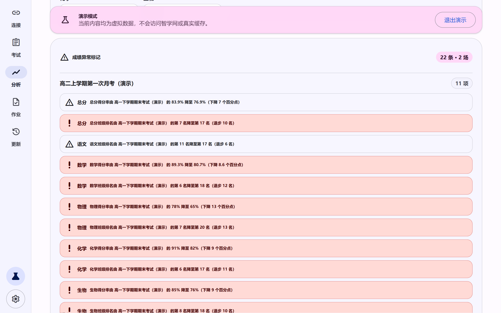
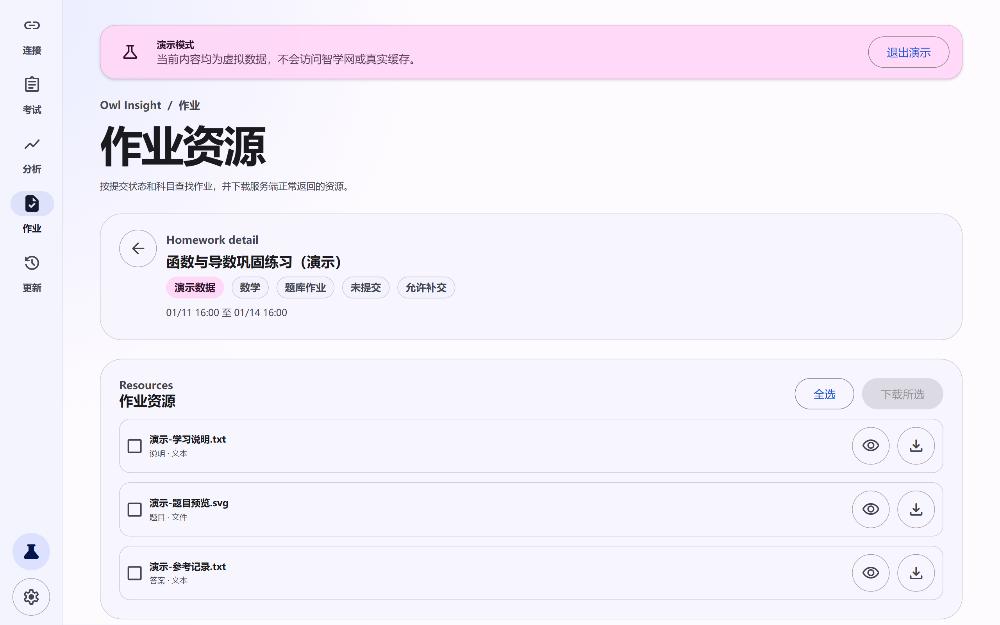

<div align="center">
  
  <h1>Owl Insight</h1>
  <p>看见成绩背后的趋势</p>
  <p>面向智学网学生端的成绩分析与作业资源浏览器扩展</p>
  <p>
    <a href="https://chromewebstore.google.com/detail/lpbejlcolhahjdjmmdgjobahllppjabo"></a>
    <a href="https://microsoftedge.microsoft.com/addons/detail/fipdjdmcibblhobffoepdmjjckllbeaj"></a>
  </p>
  <p>
    <a href="https://youtu.be/RDyku0ibpDQ"></a>
    <a href="https://www.bilibili.com/video/BV1iTNm6rEDC/"></a>
    <a href="./LICENSE"></a>
  </p>
</div>

<p align="center">
  <a href="https://www.bilibili.com/video/BV1iTNm6rEDC/"></a>
</p>

Owl Insight 用于查看考试、缓存成绩、生成本地分析并获取作业资源。当前版本为 **v2.2.1**。

## 获取扩展

- [Chrome Web Store](https://chromewebstore.google.com/detail/lpbejlcolhahjdjmmdgjobahllppjabo)
- [Microsoft Edge 加载项](https://microsoftedge.microsoft.com/addons/detail/fipdjdmcibblhobffoepdmjjckllbeaj)

商店页面在审核期间可能暂时无法公开访问，审核完成后可继续使用以上固定链接安装和接收更新。

## 演示视频

- [YouTube](https://youtu.be/RDyku0ibpDQ)
- [哔哩哔哩](https://www.bilibili.com/video/BV1iTNm6rEDC/)

视频页面在审核或转码期间可能暂时无法访问。

## 功能

- 独立连接页：自动检测并连接合适的智学网页面，也可通过 Material Design 3 下拉框手动切换，并展示学生、学校、年级和班级资料。
- 考试数据：按学年获取考试列表，查看总分、各科成绩、班级排名和单次考试雷达图。
- 成绩分析：选择在线或缓存考试生成趋势图，按考试查看可展开的异常说明。
- 本地缓存：考试详情和分析相关数据保存在浏览器本地 IndexedDB 中，兼容 v2.0.0 数据。
- 作业资源：按已提交/未提交和科目筛选作业，查看并批量下载服务端正常返回的资源。
- Material Design 3：支持浅色、深色、动态配色和无障碍状态提示。
- 公开演示模式：无需登录即可使用固定虚拟数据体验考试详情、趋势分析和作业资源；演示数据不会访问智学网或写入真实缓存。

## 界面预览

<table>
  <tr>
    <td></td>
    <td></td>
  </tr>
  <tr>
    <td align="center">成绩与排名趋势</td>
    <td align="center">单科成绩分析</td>
  </tr>
  <tr>
    <td></td>
    <td></td>
  </tr>
  <tr>
    <td align="center">异常波动洞察</td>
    <td align="center">作业资源整理</td>
  </tr>
</table>

## 从源码安装

1. 安装项目已有依赖：`pnpm install`
2. 运行构建：`pnpm run build`
3. 打开 `chrome://extensions/` 并启用“开发者模式”。
4. 点击“加载已解压的扩展程序”，选择项目的 `dist` 目录。

## 连接教程

1. 在 Chrome 中打开 [智学网](https://www.zhixue.com) 并完成学生账号登录。
2. 打开 Owl Insight，进入“连接”页面；扩展会检测合适的已登录页面并自动连接。
3. 如果自动选择的页面不合适，可在下拉框中切换页面，扩展会重新连接并验证。
4. 连接成功后即可进入考试、分析和作业页面；需要时可点击“重新检测”。

如需先了解功能，可在连接页或设置页点击“体验演示”。演示会直接打开由 6 场虚拟考试生成的成绩分析，并可继续查看考试、分类、作业预览和本地示例下载。顶部会持续显示演示状态；退出或重新打开 Owl Insight 后恢复真实模式，演示期间产生的方案、模板、备注和规则不会写入真实 IndexedDB。

Owl Insight 不会要求用户复制 Cookie，也不会把 Cookie 或临时 token 写入 localStorage、IndexedDB 或日志。登录失效时，请重新登录智学网后再次连接。

## 作业资源

- 默认显示未提交作业，可切换为已提交并按科目筛选。
- 作业会话由所选智学网页面验证，作业接口由扩展后台在已声明的 `mhw.zhixue.com` 权限范围内请求；临时凭证只在 content script 与后台单次消息中使用，不经过主 popup 或本地存储。
- 支持题库作业、自由出题和习惯练习中服务端正常返回的题目、答案、提交与说明资源。
- 单项或批量下载时，文件保存到浏览器下载目录下的 `Owl Insight/作业名/资源类别/`。
- 同名文件自动编号，不会覆盖已有文件。
- 扩展不会绕过智学网权限或尝试解锁接口未返回的答案。

## 权限说明

- `downloads`：仅在用户点击下载后保存单项或批量作业资源。
- `scripting`：用于在已打开的智学网页面缺少连接脚本时恢复连接，以及在所选页面内临时验证作业会话；不会读取 Cookie 内容。
- `declarativeNetRequest`：仅为扩展自身发往 `mhw.zhixue.com` 的作业请求补充必要的 CORS 响应头；规则受作业主机和扩展来源限制，不读取或拦截请求内容。Edge/Chrome 可能显示“管理网络请求”权限提示。
- `https://www.zhixue.com/*`：连接学生页面并获取考试、资料和临时登录凭证。
- `https://mhw.zhixue.com/*`：获取作业列表和作业资源。

扩展仅查询 `https://www.zhixue.com/*` 页面；匹配的主机权限已提供读取页面标题、地址和注入连接脚本所需的能力，因此无需额外申请 `tabs` 或 `activeTab`。主题设置使用扩展页面自身的 localStorage，成绩与分析数据使用 IndexedDB，因此无需申请 `storage`。学年请求由智学网页面上下文发起，也无需为 `ali-bg.zhixue.com` 申请扩展主机权限。

未申请 `cookies` 权限。认证请求由浏览器自动携带当前智学网会话 Cookie，扩展代码不读取 Cookie 内容。

## 开发

技术栈：Vite、React、TypeScript、CRXJS、Chrome Manifest V3、Material Web。

```text
pnpm run typecheck  # TypeScript 类型检查
pnpm run build      # 构建到 dist
pnpm run dev        # Vite 开发模式
```

### 发布扩展

1. 同步更新 `package.json`、`src/manifest.ts` 和 `CHANGELOG.md` 中的版本。
2. 创建并推送对应的 `v*` 标签，例如 `v2.3.0`。
3. GitHub Actions 会执行类型检查和构建，将 `dist` 内容打包为 `owl-insight-v2.3.0.zip`，并使用 `CHANGELOG.md` 中的对应中文版本说明发布 GitHub Release。

也可以在 Actions 页手动运行 `Build and release extension`，并填写已经存在的版本标签。标签版本、`package.json` 版本或构建后 Manifest 版本不一致时，发布会停止。

主要目录：

- `src/popup`：React 应用、连接页、考试/分析页面和作业页。
- `src/background`：Manifest V3 service worker，负责工具栏入口和作业接口代理。
- `src/content`：扩展消息与页面消息的桥接层。
- `src/injected`：在用户选择的智学网页面中请求接口，不持久化认证凭证。
- `src/shared`：共享协议、类型、缓存和分析逻辑。

## 注意事项

- Owl Insight 是第三方独立扩展，与智学网官方不存在隶属或合作关系。
- 智学网接口可能随服务端更新而变化；失败提示会标明功能模块和建议操作。
- 真实数据验证需要用户本人已登录的智学网页面。
- 排名和资源内容以智学网当前账号实际返回的数据为准。
- 请合理控制请求与批量下载频率。
